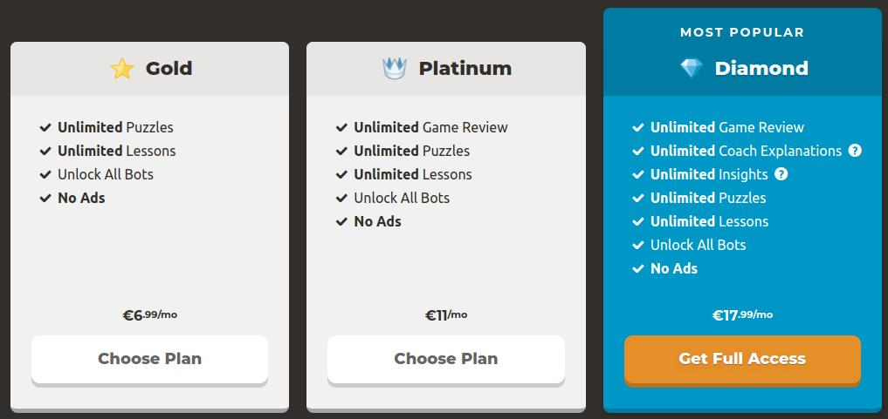

# Schach Online

Hier eine Sammlung der Ressourcen, die übergreifend interessant sind. Beim Training dann werden diese referenziert.

## Plattformen

Die folgenden Plattformen sind in mehrfacher Hinsicht bekannt, und werden deshalb zuerst aufgeführt.

### Lichess

Lichess ist mein Favorit, aus den folgenden Gründen:

* Lichess ist kostenfrei, ohne dass dadurch die nutzbaren Feature in irgendeiner Form eingeschränkt wären. Keine Paywall, und das Versprechen, dass alles immer kostenfrei bleibt. Damit keine Hürde für ein (Jugend-)Training.
* Lichess hat ein fantastisches Set an Werkzeugen, die beim Training unterstützen. Und vieles ist genau auf die Situation hin getrimmt, und wird von keinem anderen Anbieter in der Form erreicht.
* Lichess hat eine tolle Community, mit vielen Leuten, die sich gegenseitig helfen.
* Und es gibt auch hier immer wieder bekannte Persönlichkeiten, die auch auf Lichess auftauchen, streamen, ... (Bevor Magnus von chess.com gekauft wurde, war er öfter auf Lichess zu finden.)

Man findet detaillierte Informationen zu Lichess [hier](https://schachtraining-lichess-discord.netlify.app/docs/lichess). Die Feature, die wir fürs Training besonders brauchen, sind:

* [Studien](https://schachtraining-lichess-discord.netlify.app/docs/lichess#nutzung-von-studien): Eine Art kleine Datenbank von PGN Partien, mit allen Möglichkeiten, die Chessbase auch bietet. Besonders ist, dass die Studie parallel von mehreren Leuten synchron genutzt werden kann.
* [Teams](https://schachtraining-lichess-discord.netlify.app/docs/lichess#erstellung-und-nutzung-eines-teams): Damit kann man im Training typische Situationen gut unterstützen, wie Turniere anbieten, Simultan, ...
* [Aufgaben, Spiele, ...](https://schachtraining-lichess-discord.netlify.app/docs/lichess#weitere-m%C3%B6glichkeiten-f%C3%BCr-das-training): Übersicht über die weiteren Möglichkeiten, nicht detailliert dargestellt.

Lichess hat darüber reichhaltige Möglichkeiten, viele Einstellungen für alles mögliche. Teilweise könnte dies auch im Training verwendet werden. Hier beispielhaft zwei Feature:

* Zen Mode: Kann man beim Spielen, bei den Puzzlen, bei Turnieren einstellen. Dabei wird nichts mehr außer dem Brett und wenn nötig die Uhr angezeigt. Kein Chat, keine anderen Elements. Der Fokus bleibt auf dem Spiel.
* Blindschach: Dabei spielt man ohne Ansicht der Figuren, d.h. man sieht nur das Brett, aber keine Figuren darauf. Habe ich selbst nie ausprobiert, aber für (viel) bessere Spieler ist das sicher eine Möglichkeit, ihr Visualisierungsvermögen zu trainieren.

### chess.com

Chess.com ist die Top-100 Plattform für Schach, die einen wahnsinnigen Zuwachs während Corona erfahren hat. Chess.com hat sehr viel Geld, und gibt das auch für Prominente und viele gute Angebote aus. Aber umgekehrt muss (viel) Geld eingenommen werden, sodass viele Angebote bei chess.com kostenpflichtig sind. 

D.h. wenn man kein Geld bezahlt, dann entfällt alles, wo im Bild oben unlimited steht.

Hier die Features, die für ein Training nützlich sein könnten:

* [Analyse](https://www.chess.com/analysis?tab=analysis): Die kann zwar durchgeführt werden, ist aber leider kostenpflichtig, wenn man die Analyse speichern möchte (was man für ein Training ja muss). Der Opening Explorer → kostenpflichtig
* [Clubs](https://www.chess.com/clubs): Ähnlich wie bei Lichess, mit einem Chat, Turnieren, usw. usf.
* [Taktiktraining](https://www.chess.com/puzzles): Leider auch hier mit Paywall (5 pro Tag frei). Auch hier kann systematisch bestimmte Themen trainiert werden. Ich werde mir mal für 1 Monat die teuerste Lizenz holen, um hier die Möglichkeiten auszuloten.

Der Eindruck zur Zeit ist, dass auch Teilnehmer des Trainings mindestens die einfachste (Gold) kostenpflichtige Version benötigen, unter Umständen sogar Platinum (für die Unterstützung der Analyse von Partien). Der Versuch mit der kostenpflichtigen Version wird dann zeigen, ob chess.com hier das gleiche Niveau hat wie Lichess.

### Chess24

Chess24 war einmal eine vollständige Plattform, mit allem drum und dran. Seit dem Verkauf der Play-Magnus-Gruppe wird Chess24 zwar in chess.com integriert (streamen von Veranstaltungen), aber seitdem sind auch einige Features verloren gegangen. Chess24 war immer (auch) kostenfrei, man konnte auch Premium-Member werden. Seit dem Zusammenschluss ist [diese Meldung](https://new.chess24.com/premium?source=redirect-chessdb) zu sehen. Damit sind auch alle Analysemöglichkeiten, die in der Vergangenheit da waren, nicht mehr zugänglich.

### Chessbase

Chessbase hat sich neben dem Hersteller für Schachsoftware (siehe [Werkzeuge Chessbase](./werkzeuge.md#chessbase)) auch als Plattform etabliert (bzw. versucht, sich zu etablieren). Meines Erachtens ist das nicht gelungen, mein Versuch, dort ein wenig Schach zu spielen war eher kläglich. Die Chessbase Website bietet Folgendes an:

* Aktuelle Artikel rund ums Schach, auch viel Eigenwerbung.
* Natürlich ein Laden, in dem man Chessbase-Artikel kaufen kann.
* Einen Bereich zum Spielen, mit gefühlt recht wenig aktiven Leuten dort. Die Oberfläche zum Analysieren und Nachspielen ist seltsam, ich kam damit nicht zurecht.
* Werkzeuge zum Analysieren direkt habe ich nicht gefunden, man kann aber mit dem vorbereiteten Material von Chessbase arbeiten.

Aus meiner Sicht ist Chessbase keine vollständige Plattform.

### Chessable

[Chessable](https://www.chessable.com/) war etwas Besonderes, als es neu entstand. Computer Based Training, einige freie Kurse, sehr gute Trainer, und exzellentes Material. Aber jeder, der das mal versucht hat, merkt, dass man seine Grenzen hat, was man an einem Tag lernen und trainieren kann. Und für viele Trainings ist die Art nicht geeignet. Warum wird das unter den Plattformen (für Training) noch aufgeführt? Chessable hatte/hat ein interessantes Feature namens Classroom. Ich habe das mit einem Schüler mal ausprobiert, und das hat so leidlich funktioniert. Inzwischen ist das Einstellen von Inhalten deutlich einfacher, und man kann z.B. direkt mit einer Lichess-Studie starten, und mit Schülern dann durchgehen. Chat, Kamera, Ton, Schachbrett, alles integriert ...

Das Einrichten des Classrooms war umständlich, d.h. man musste sich als Trainer registrieren, und die Schüler müssen alle Mitglied bei Chessable sein. Das ist meines Erachtens die größte Einschränkung. Danach hat man aber eine voll funktionsfähige Lernumgebung, in der man Online-Schachkurse durchführen kann. Man kann heute schwer abschätzen, ob und wie lange die Plattform in der Form weiter existieren wird ... Es ist noch zu prüfen, ob die Classrooms von Chessable bei chess.com drin sind, oder ob das was anderes ist.

### Chesstempo

Chesstempo war mal die beste Website, wenn es um Taktikaufgaben ging, aber die Entwicklung dort scheint inzwischen hinterherzuhinken. Die UI ist teils alt, teils neu (auch für unerfahrene Webnutzer leicht zu sehen), und wirkt verglichen mit Lichess und chess.com nicht schön. Und leider gibt es auch hier immer wieder eine Bezahlschranke (Upgrade auf Premium, um ..., siehe [Membership](https://chesstempo.com/memberships/)).

Die Möglichkeiten der Plattform sind relativ umfangreich, der Spielbereich ist aber (wie Chessbase) wenig genutzt. Wenn man gespielt hat, ist die Analyse sehr schön, gut unterstützt. Leider kann man die Engines nur mit einem kostenpflichtigen Account nutzen.

Die Partiendatenbank ist recht umfangreich, aber sperrig zu verwenden, und Teile nur bei kostenpflichtigen Accounts zu bekommen. Die Schachtaktiken sind schön, auch die dort skizzierten Themenbereiche sind gut gestaltet. Das ist der Bereich, der nach wie vor ähnlich gut wie Lichess oder chess.com ist. Chesstempo hat viele weitere Feature, es ist unklar, wie gut genutzt Chesstempo ist.

## Spielen

Beim Spielen kommt es auf die folgenden Möglichkeiten an: Welche Arten werden geboten; welche Bedenkzeiten sind verfügbar; kann man die Bedenkzeit, die man gerne mag, auch oft genug spielen; ...

Hier ein Vergleich der Plattformen.

| Plattform    | Varianten | Bedenkzeiten                   | Turniere                                                                                                              | Bemerkungen                                                          |
|--------------|-----------|--------------------------------|-----------------------------------------------------------------------------------------------------------------------|----------------------------------------------------------------------|
| chess.com    | Viele     | 1:0; 1:1; 2:1, 3:0, usw. usf. Man kann auch frei wählen. | Swiss und Arena (von Lichess abgeschaut), die leicht anders funktionieren.                                            | Manchmal seltsame Benutzerführung, aber in Summe so gut wie Lichess. |
| chesskid.com | Standard  | unklar, es geht um Kinder      | -                                                                                                                     | teils nett gemacht, teils nervig. Und ohne Geld auch nicht wirklich spielbar. |
| Lichess      | Viele     | [ähnliche Formate](https://lichess.org/) | Arena dominiert, andere wurden später hinzugefügt. Lichess ist für seine Turniere mit (SEHR) vielen Spielern bekannt. | Meines Erachtens die am besten konsistente Oberfläche (aber ich arbeite auch seit Jahren damit). |
| Chessbase    | Standard | 1:0; 3:0, 3:2; 5:0, 10:0; 15:5; frei | Scheint tot zu sein | Aus meiner Sicht zum Spielen ungeeignet, die Möglichkeiten von chess.com und Lichess sind nicht mehr einzuholen. |
| Chesstempo   | Standard | Viele, frei definierbar | Unbekannt | Der Bereich, der bei Chesstempo relativ wenig gepflegt aussieht, |
| ICC          | Standard  | Frei, über die ICC Oberfläche. | -                                                                                                                      | Ohne Geld war kein richtiges Ausprobieren möglich, zwischen 10$ (Monat) und 70$ (Jahr). |

### Lichess

Spielen auf Lichess hat eine Reihe von weiteren Featuren, die nicht in der Tabelle oben zu finden sind:

* Freies Spielen
  * Gewertete oder ungewertete Partien: Ungewertete Partien stehen auch nicht angemeldeten Spielern zur Verfügung.
  * Simultan: kann von jedem registrierten Spieler eingestellt werden, mit einigen schönen Featuren, dem Simultan auch von außen zu folgen.
  * Verschiedene Varianten von Schach, viele davon kannte ich davor nicht. Ausgenommen ist hier Bughouse (Tandem).
* Turniere
  * Es dominieren die (großen) Arenaturniere, bei denen man nach dem Ende einer Partie schon die nächste spielen kann. (Wurde von chess.com übernommen) Man kann jederzeit ein- und auch aussteigen, was ein großer Vorteil ist. Und man muss nach einem schnellen Blitzsieg nicht 9 Minuten auf die anderen warten.
  * Auf vielfachen Wunsch wurden auch Schweizer Turniere eingeführt, die man kennt.
  * Lichess hat viele Jahresturniere
    * Frühling/Sommer/Herbst/Winter, mit > 10.000 aktiven Spielern.
    * Monatliche Shield-Turniere, der Gewinner behält den Shield bis zum nächsten Turnier.
    * Titled Turniere, bei denen nur Titelträger erlaubt sind. Dort wird dann viel gestreamt.
    * ...
  * Teams können eigene Turniere einstellen, die Teamleader sind dazu berechtigt. Das können Team-interne Turniere sein (Arena oder Schweizer System), oder auch ein Teamkampf, bei dem mehrere Teams gegeneinander antreten. Dabei kämpft man nur  gegen Mitglieder anderer Teams, und die Punkte werden addiert.

### chess.com

chess.com bietet vergleichbare Spielmöglichkeiten zu Lichess. Die Anzahl der Varianten ist dort noch höher, viele habe ich noch nie ausprobiert, und weiß auch nicht, ob man dort Mitspieler findet. Varianten zusätzlich sind: Bughouse (4 Spieler), Duck Chess, Fog of War, Setup Chess und Custom Rules, bei dem man die zusätzlichen Regeln selbst zusammenmixen kann.

Ich finde die Turniere bei chess.com etwas unübersichtlich, ich habe auch noch keinen schnellen Weg gefunden, in aktuelle Arenaturniere einzusteigen. Wenn man auf Play > Tournaments geht, sieht man die zukünftigen Turniere. Wenn man auf Play geht, dort den Button Tournaments, landet man in der Übersicht von laufenden und zukünftigen.

Die Teams von Lichess sind bei chess.com Clubs. Auch dort werden (online) Turniere organisiert, ...

### Chesstempo

Einstieg ist Spielen > Online Spielen, dort sieht man dann die Spielangebote, die von anderen eingestellt wurden. Man selbst ein eigenes Angebot einstellen, und dann darauf warten, dass jemand anders das annimmt. Hat bei mir gleich funktioniert (Zeit: 2:0). Nach einem Spiel bekommt man eine automatische Analyse, die eine recht gute Qualität hat. Das Brett hat alle Möglichkeiten, die man braucht, pre move geht, ziehen über drag&drop vs. klicken, ... 

## Analysieren

Welche Werkzeuge bietet die Website an, welche Feature genau sind dann verfügbar, wie analysiert man damit dann? Hier wird sicher eine einfache Tabelle nicht genügen. Hier wird die Luft schon sehr viel dünner. Deshalb pro Website, die hier was zu bieten hat, ein eigenes Kapitel.

Die folgenden Kriterien für die Analyse sind wesentlich:

* Kann die Analyse auf beliebigen Spielen durchgeführt werden?
* Wie wird die manuelle und automatische Analyse unterstützt?
* Können Analysen gespeichert werden?
* Kann man Züge annotieren?
* Kann man Analysen mit anderen Spielern oder sogar anonym teilen?

In Summe ist aber die Vermutung:

* Lichess kann uneingeschränkt zur Analyse eingesetzt werden. Alle Feature, die notwendig sind, werden unterstützt.
* chess.com kann mit einer kostenpflichtigen Mitgliedschaft empfohlen werden, dann sind die bereitgestellten Feature vergleichbar.

### Lichess

Von mir seit Jahren verwendet, auch als ich noch Zugriff auf Chessbase hatte. Hat aus meiner Sicht alle Feature, die man sich dafür nur vorstellen kann. Hier einige Links in die andere Dokumentation, mit ein wenig Erläuterungen:

* [Studien in Lichess](https://schachtraining-lichess-discord.netlify.app/docs/lichess#nutzung-von-studien)
  * Studien sind **das** Mittel der Wahl, wenn man Partien und Stellungen analysieren möchte. Dabei kann man mit einer Stellung starten, mit dem Analysebrett, aber am Ende wird in der Studie der Fortschritt manifestiert.
  * Studien haben bis zu 64 Kapitel, sprechende Namen, und viele Einstellungen. Je nach Kombination der Einstellungen kann man ganz unterschiedliche Effekte erreichen.
  * Studien können geteilt, und andere daran beteiligt werden. Das erlaubt es z.B. unserer Mannschaft, ihre Partien in Lichess (vor der Öffentlichkeit natürlich verborgen) zu erfassen und zu zeigen.
* Der Übergang von gespielten Partien, dem Analysebrett oder auch dem Bretteditor ist einfach: Wenn man die Stelle kennt, ein Klick, Studie auswählen (oder neu erstellen), fertig.
* Man kann praktisch von allen Partien aus, auch denen, die man live zuschaut, direkt in die Analyse springen. Und wenn man das ernsthaft behalten möchte, macht man eine Studie daraus.

### Chess.com

Vielleicht mache ich noch eine Probe (samt Geld), die Frage ist, wann das für den Kurs am besten ist. Vermutlich erst so, dass man am Kurs selbst auch das Probeabonnement haben kann. (Nachdem ich vor Jahren einmal Probleme hatte, ein kostenpflichtiges Abonnement loszuwerden, bin ich da inzwischen sehr vorsichtig).

Unter [learn > analysis](https://www.chess.com/analysis?tab=analysis) ist der Einstieg. Man kann dort ein PGN hochladen, und das dann mit oder ohne Engine untersuchen. Ich habe keine Möglichkeit gefunden, eigene Kommentare hinzuzufügen (seltsam).

Ansonsten ist chess.com eine Plattform, die alles anbietet, was man sich für Schach nur vorstellen kann. Die Varianten, die es dort gibt, sind endlos, und es macht sicher Spaß, einige davon auch auszuprobieren.

Hier eine Sammlung der Themen, die für das Training interessant sein können:

* Play > Custom Classroom: Man kann dort einen eigenen Analyseraum erzeugen. An dem können dann andere Mitglieder auch teilnehmen. Man selbst benötigt für die freie Teilnahme einen höherwertigen Account.

### Chesstempo

Chesstempo erstellt für alle Partien, die man selbst (online) gespielt hat, eine automatische Analyse. Diese wird aber serverseitig erstellt. Wenn man die Stellung durchspielt, dann bekommt man keine Unterstützung durch eine Engine. Wenn man einen kostenpflichtigen Account hat, bekommt man eine serverseitige Engine zur Verfügung gestellt. Diese funktioniert ausreichend gut, ist aber nicht so einfach zu finden und zu bedienen.

Die UI zur Analyse ist gewöhnungsbedürftig, scheint aber alles zu haben, was man dafür benötigt. Es ist mir noch nicht gelungen, eine Analyse in der Art von Studie wie bei Lichess durchzuführen. Man benötigt dazu eine eigene (oder fremde) Partie. Von daher kann Chesstempo für das Training nur eingeschränkt verwendet werden. Ich werde noch mit der Gold-Mitgliedschaft (3,67 Euro im Monat) noch Versuche machen.

## Apps der Plattformen

Einige der Plattformen bieten auch Apps für Android oder iOS an, und man sollte wenigstens das Bekannte über die Apps notieren. Dabei muss man teils noch unterscheiden, ob man die Apps auf einem Handy oder einem Tablett nutzt.

### Lichess

Die App habe und nutze ich schon lange, und kenne ihre Einschränkungen recht genau. Sie bietet einige der Feature von Lichess (Web-Version) an, aber lange nicht alle. Die für das Training wichtigste Einschränkungen sind:

* Man kann mit der App nicht sinnvoll Studien anlegen, verwalten oder ändern. Wir erleben hier immer wieder Überraschungen ...
* Und selbst als Leser einer Studie funktioniert nicht alles genau so,  wie bei der Web-Oberfläche.

Die App nutzt natürlich (wie alle anderen Apps auch) den Account, den der Spieler schon hat. Damit kann man leicht zwischen den verschiedenen Geräten hin- und herwechseln, und hat jeweils Zugriff auf die eigenen Spiele, Analysen, Nachrichten usw.

Es gibt die Info, dass die App aktuell (Mitte 2023) neu entwickelt wird, aber leider noch nicht verfügbar ist. Siehe das [Interview mit dem Lead-Entwickler](https://lichess.org/blog/Y2Z47hEAAGUB7i7A/lichess-recruits-full-time-mobile-developer) für Details.

### chess.com

Hat sich über die Jahre ebenfalls entwickelt, und deckt einen Großteil der Möglichkeiten von chess.com ab. Ich war positiv überrascht, als ich die App wieder verwendet hatte, und für Puzzles und schnelle Spiele ist die App mehr als ausreichend. Ich hatte noch nicht die Gelegenheit, mit die Analyse detailliert anzuschauen, aber ich vermute, dass die App hier auch nicht besser ist als die Web-App.

### Chesstempo

Es war eine Überraschung, dass es diese App überhaupt gibt, aber leider keine Überraschung, wie seltsam sie funktioniert. Die Web-Oberfläche ist gewöhnungsbedürftig, aber für Fans sicher noch ok. Die Taktik-Möglichkeiten gibt es größtenteils, und das wäre eine gute Nachricht, dafür ist Chesstempo auch wirklich gut geeignet.

### Chessable

Ist eine leichtgewichtige Oberfläche, um vor allem das Trainieren von Büchern zu unterstützen. Ich hatte das im Urlaub schon dabei, und habe dann jeden Tag 1-2 Stunden mit dem Training von Varianten verbracht. Funktioniert gut, ist ausreichend. Weitere Feature habe ich dort nicht gesucht, und damit auch nicht vermisst.
